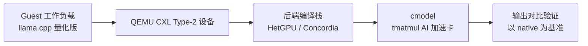
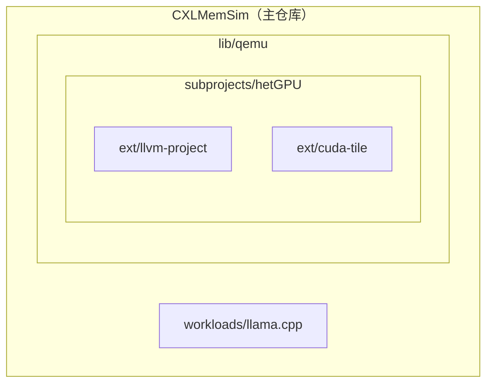

# CXLMemSim Blog - rd

!!! note "主要贡献者"

    - 作者：[@random25160765-collab](https://github.com/random25160765-collab)

> CXLMemSim 项目复盘与 Postmortem（2026 年 7 月），兼个人工程经验总结。
>
> 本阶段聚焦加速卡后端编译栈（HetGPU），QEMU CXL 设备与 CXLMemSim 的集成尚未开始。
>
> 本文含 AI 辅助创作，请注意甄别。

**TL;DR**：SASS lifter 这条路修不好、也不值得修——它的下游消费者同样不扎实。最终我放弃 HetGPU、改走 PyTorch/TVM。但开发中沉淀的 harness 方法论（让 agent 执行形成闭环的验证工程）可以迁移到任何 AI 辅助开发场景。

## 1. 项目介绍

这里再向不熟悉的朋友们介绍一下这个项目。

这是一个多层联合仿真工程，将 Guest 工作负载 → QEMU CXL 设备模型 → 后端编译栈 → cmodel（加速卡的软件行为模型，在仿真环境中代替真实硬件）串联成完整实验链路，其中 CXL 设备模型 + 编译栈 + cmodel 共同构成对 AI 加速卡的完整建模：



项目涉及的组件有：

1. zettai 维护的 QEMU CXL Type-2 设备扩展 [qemu-cxl-type2](https://github.com/Zettai-US/qemu-cxl-type2)<sup>[1]</sup>
2. CXL Type-3 内存仿真器 [CXLMemSim](https://github.com/SlugLab/CXLMemSim)<sup>[2]</sup>
3. 加速卡后端编译栈 [HetGPU](https://github.com/Multi-V-VM/hetGPU)<sup>[3]</sup>
4. 容错推理模块 [Concordia](https://github.com/vickiegpt/Concordia)<sup>[4]</sup>
5. tmatmul AI 加速卡：cmodel 由 [Concordia](https://github.com/vickiegpt/Concordia)<sup>[4]</sup> 提供
6. 工作负载：llama.cpp 的量化版 [ik_llama.cpp](https://github.com/ikawrakow/ik_llama.cpp)<sup>[5]</sup>
7. Guest VM: CXLMemSim 的 README 里有提及 [spack](https://github.com/vickiegpt/spack)<sup>[6]</sup>，可以在里面找到 Guest VM 的链接。

需要特别注意，Concordia 和 HetGPU 两者代码同源，README 未做区分。

以下是部分背景知识的介绍：

??? note "GGUF 与量化"

    GGUF 是 llama.cpp 项目定义的一种模型文件格式：把 tokenizer 词表、模型超参（层数、隐藏维度、MoE 专家数）和所有权重矩阵打包进单个文件。文件名里的 `IQ1_M` 是量化方法的代号。

    量化是训练后压缩：把 16 位浮点权重压到平均约 1.6 比特（约为原来的 1/10）。做法是按 256 个权重一组切 block，每组算一个 16 位缩放因子，每个权重只存 2 比特的码本索引；推理时查表把索引恢复成近似浮点值，再乘上缩放因子。这和 BitNet 那种"权重直接约束为 -1/0/1"的三值量化是两条路线——前者是通用查表压缩，后者是训练时就限定取值。

    GGML 是 llama.cpp 底层的张量计算库，为每种量化格式提供手写 CUDA kernel 做反量化和矩阵乘法。例如 `dequantize_iq1_m` 这个 kernel 约 300 条 SASS 指令，把 IQ1_M 权重解压成 fp16 再送入矩阵乘法单元——这正是后面编译栈要处理的核心目标。

??? note "BitNet 量化"

    GGUF 量化属于训练后压缩，即先以全精度训练模型，再将权重映射到低比特。BitNet 量化在训练阶段就约束权重只能取 -1、0、1 三个值，不经过“全精度训练→后压缩”的过程。

    标准 Transformer 层的矩阵乘法为 $y_j = \sum_i x_i\, w_{i,j}$，其中 $x$ 是输入向量、$W = (w_{i,j})$ 是权重矩阵、$y$ 是输出向量。假设输入是 4096 维向量、权重是 4096×4096 的矩阵，一次矩阵乘法要执行 1670 万次浮点乘加。BitNet 把权重矩阵替换成三值矩阵，即 $w_{i,j} \in \{-1, 0, 1\}$，乘法于是退化为带符号累加：

    $$
    y_j = \sum_i x_i\, w_{i,j} = \sum_{i:\ w_{i,j}=1} x_i - \sum_{i:\ w_{i,j}=-1} x_i
    $$

    （权重为 0 的项直接跳过）

    乘法运算被消除，仅保留加法和减法。从硬件实现的角度，一个浮点乘法器需要几千个晶体管，一个加法器需要几百个。去掉乘法单元节省的硅面积可用于增加并行计算单元数量，或降低功耗。

    对应的模型是 Matmul-free LM，有 370M、1.3B、2.7B 三个参数规模，通过 HuggingFace 分发。在同等参数规模下效果接近传统 Transformer。2.7B 版本在 FPGA 上的推理功耗约 13W。

    Matmul-free 模型见 [matmulfreellm](https://github.com/ridgerchu/matmulfreellm)<sup>[9]</sup>。

??? note "tmatmul 硬件"

    tmatmul 是 Ethan Sifferman（UC Santa Cruz）为三元模型设计的 FPGA 加速器，源码开源。

    常规 GPU 需要支持 fp32、fp16、bf16、int8 等多种精度，片上集成了大量浮点乘法器。tmatmul 只处理三值运算，不包含乘法单元，用更少的逻辑资源换取更高的并行度。它的指令集只覆盖一条推理链路的最小操作集合：

    | 指令 | 作用 |
    |------|------|
    | `tmatmul.ldv` | 从内存加载向量到寄存器 |
    | `tmatmul.norm` | RMS 归一化 |
    | `tmatmul.mm` | 三元矩阵乘法 |
    | `tmatmul.sv` | 存储向量到内存 |
    | `tmatmul.sig` | 激活函数 |

    每条指令对应硬件上的一级流水线。一次推理被编码为 96 字节的程序描述符，通过 PCIe 写入 FPGA 的指令寄存器，硬件按顺序执行。

    Vivado 合成在 Xilinx xc7a200t（Artix-7）和 xcu250（Alveo U250）两个目标上均通过。配套的 Python 模拟器可以脱离硬件进行推理正确性验证，输出与官方 PyTorch 实现一致。

    核心 IP 见 [ternip](https://github.com/sifferman/ternip)<sup>[10]</sup>。

## 2. 环境搭建

大概 7 月初的时候开始看这个项目，当时手上只有一台商务本，性能太差跑不动，因此考虑在 CNB 上进行项目开发。CNB (Cloud Native Build) 是腾讯云的开发者平台，基于 Docker 生态提供代码托管、CI/CD 流水线、云原生开发、制品管理等服务（见 <sup>[7]</sup>）。

在搭建环境的过程中，我碰到了两个典型问题：

**组件间的兼容性** — 理想状态下最终的依赖清单应该是所有组件依赖的并集，但不同版本的工具链之间经常出现兼容性问题。

- **对策：** 打个补丁，或者干脆装两个版本。

**版本漂移** — 组件内部对工具链 ABI 有隐式依赖（其实就是 concordia 的 shim），一换版本就出 bug，如何保证组件和工具链版本不漂移？

- **对策：** 组件版本用 git submodule 控制，工具链版本写死在 Dockerfile 里。

!!! bug "CUDA SDK 与 glibc 的 noexcept 冲突"

    较新版本的 glibc（≥2.27）和旧版 CUDA 头文件组合时会编译失败。glibc 的 `__THROW` 宏在 C++11+ 模式下展开为 `noexcept(true)`，带异常规格的声明经 libstdc++ `<cmath>` 的 `using` 进入 `std::`；而 CUDA 的 `<crt/math_functions.h>` 会把 sinpi/cospi 等 device wrapper 也注入 `std::`，却不带 `noexcept`——同一函数两份冲突的异常规格，编译器报 `edit_no_rtti_decl` / `conflicting exception specification`。最新的 CUDA 13.3 已内置修复，此问题只影响旧版 CUDA（12.x 及更早）。

??? note "冲突机制详解"

    这个报错是三层合作的产物，每一层角色不同：

    **A 方 — CUDA `<crt/math_functions.h>`（旧版，无 glibc 检测机制）**

    ```c
    // 全局作用域 — device 端声明，无 noexcept
    extern __DEVICE_FUNCTIONS_DECL__ __device_builtin__ double sinpi(double x);
    // std 命名空间 — host wrapper（__func__ 宏展开为 inline）
    __func__(double sinpi(double a));    // → inline double sinpi(double a);
    ```

    **B 方 — glibc `<math.h>` + libstdc++ `<cmath>`**

    glibc 在 `/usr/include/math.h` 声明 `extern double sinpi(double __x) __THROW;`，而 `__THROW`（`sys/cdefs.h` 第 86 行）在 `__cplusplus >= 201103L` 时定义为 `noexcept(true)`。libstdc++ `<cmath>` 先 `#include_next <math.h>` 把 glibc 的声明引入全局空间，再通过 `using ::sin;` 等把这些带 `noexcept` 的声明拉进 `std::`。

    **冲突发生点**：`std::` 命名空间里同一函数出现两份冲突的异常规格——

    ```
    libstdc++ 提供：std::sin(double) noexcept(true)   ← 源自 glibc 的 __THROW
    CUDA 注入：std::sin(double)                        ← 无异常规格
    ```

    编译器拒绝这个 `conflicting exception specification`。

    **noexcept 到底是谁的？** 字面值来自 glibc 的 `__THROW` 宏展开，但报错位置在 libstdc++ 的 `std::` 命名空间。说"归给 glibc"容易让人误以为 glibc 直接在 `<math.h>` 里写了 C++ 关键字 `noexcept`——实际是宏在 C++ 编译模式下的展开结果，经 libstdc++ 的 `using` 才进入冲突域。

    **CUDA 13.3 的官方修复**（无需 patch）：在 `<crt/math_functions.h>` 里检测 glibc 是否已提供 IEC 60559 函数——

    ```c
    #include <features.h>
    #if __GLIBC_PREREQ(2,41) && (__GLIBC_USE_ISOC23 || defined(__STDC_WANT_IEC_60559_FUNCS_EXT__))
    #  define __NV_GLIBC_PROVIDES_IEC_60559_FUNCS 1   // glibc 已提供，CUDA 不注入
    #else
    #  define __NV_GLIBC_PROVIDES_IEC_60559_FUNCS 0   // glibc 未提供，CUDA 自己注入
    #endif
    ```

    device 端声明用 `__THROW` 与 glibc 对齐，host wrapper 的注入也被 guard 包住：

    ```c
    #if !__NV_GLIBC_PROVIDES_IEC_60559_FUNCS
    __func__(double sinpi(double a));   // 仅在 glibc 未提供时才注入 std::
    #endif
    ```

    **我们的 patch 针对的是哪个版本？** `cuda-glibc-noexcept.patch` 直接写死 `noexcept` 关键字（而非 `__THROW`），说明它针对没有上述检测机制的旧版 CUDA（12.x 或更早）——给 CUDA 侧也补上 `noexcept`，让两边异常规格一致：

    ```
    glibc → 全局空间 ::sinpi(double) noexcept
          → libstdc++ using ::sinpi → std::sinpi(double) noexcept
    CUDA  → __func__(double sinpi(double a)) → std::sinpi(double)   ← 冲突
    ```

??? note "git submodule 是什么？"

    把另一个 Git 仓库嵌在你的项目目录里，两边各自独立管理版本：

    ```text
    你的项目/
    ├── .git/
    ├── .gitmodules          ← 记录子模块的 URL 和路径
    ├── 你的代码/
    └── third_party/
            └── ternip/      ← 指向 ternip 的某个 commit
                └── .git     ← 独立的 Git 仓库
    ```

    关键点：父仓库不记录子模块的代码变动，只记录一个 commit SHA。子模块更新了，父仓库只改一行 SHA。

    （详见 Git 官方文档 <sup>[8]</sup>）

这种复杂度的项目，组件之间的依赖关系呈树状嵌套结构，git submodule 可以很好地解决版本漂移的问题。当前我的环境结构是这样的：



submodule 在这里的核心价值是锁定版本：每个子模块只记录一个 commit SHA，拉代码的人拿到的是确定的版本组合。嵌套 submodule 的推送比较复杂。基本流程是：所有子模块各自 commit 改动 → 从下往上逐级同步版本。

举个例子，假设我改了 HetGPU 的代码，那就是 commit → push hetGPU → 更新 QEMU 侧 hetGPU 的 submodule 指针 → push QEMU → 更新 CXLMemSim 侧 QEMU 的 submodule 指针。三层推送，顺序不能错：

```bash
# 三层推送，顺序不能错（各组件 main 分支名还不一样）
git push origin tmatmul       # hetGPU（分支: tmatmul）
git push origin master        # QEMU（分支: master，先更新子模块指针）
git push origin main          # CXLMemSim 主仓库（分支: main）
```

漏了中间 QEMU 那一步——只推了 hetGPU 和主仓库——下一个 `git clone --recursive` 的人拿到的 QEMU SHA 还是旧的，里面的 hetGPU SHA 也是旧的，链条断裂，版本就全乱了。

这个流程有点繁琐——甚至每个组件的 main branch 名字都不一样。做成工作流是最佳方案：命令通过脚本固化，skill 再调用脚本，agent 自动完成所有同步。后续想继续打磨质量并做成小工具，专门针对依赖多级 submodule 编排组件的场景。

另外，CNB 平台在环境关闭之后，工作区内未提交的文件会暂时保存，但子模块内的未提交文件不会！也就是说，如果在 CNB 上修改了子模块，关闭环境之后再打开，子模块的改动会丢失。

然后是工作负载的选择。实验文档里提到了 Kimi K2.6 IQ1_M 这个模型，这不是 BitNet 量化，但这暂时不重要——Kimi K2.6 太大了，选它作为负载绝对是一个糟糕的选择。

尽管采取了 IQ1_M 量化，它依然有 200+GB，下载就要十几个小时——CNB 还有 10 分钟无操作关闭环境的机制，我得守在电脑边盯着它下完。

机器也撑不住。CNB 只给一张 48GB 显存的 L40（似乎还是共享的，经常 offload 1 层就 OOM），模型根本放不下，剩下的层全落到 CPU 上执行——跑一次推理要半个小时（0.05 TPS），更不用提在 QEMU TCG 下的表现。

这种推理速度，做性能优化和打榜没有任何意义，也大大拖慢了开发迭代的效率。

其实早该换模型的，但自己一个人沉浸在开发里容易钻牛角尖，事后复盘的时候才发觉。

## 3. 找到开展工作的切入点

> 项目最大的障碍：每一个环节都是非标软件——CXL Type-2 设备、CXLMemSim、HetGPU、Concordia、tmatmul 的 cmodel——每一个地方都可能成为 bug 的来源，直接接上调试绝对不是一个好主意。

稳妥起见，我采取“控制变量法”，也就是一次只修一个组件，被修组件前后使用可信赖的软件栈。

举个例子，我要修 HetGPU，就拿 llama.cpp 直接当 HetGPU 的负载。llama.cpp 经过 cuda shim 走 native 执行 / HetGPU 后端编译管线，两者对比，以 native 为准。整个过程只有 HetGPU 一个被校正的部件。如果要修 QEMU 的 CXL Type-2 设备，就在 Guest VM 里运行 llama.cpp，让 CUDA 调用经 cuda shim 落到 QEMU 的 CXL 设备上执行，输出再和 native 路径对照。

环境搭好之后，我就着手进行 bug 的修复。第一个模块是 HetGPU，验证流程就是 llama.cpp → shim → HetGPU 或 native，然后对比输出是否一致。

## 4. Native 路径

shim 本身修起来难度不高，agent 很快就修好了。这一步修好之后 Native 路径基本通了：llama.cpp 经过 CUDA shim 直接调用真实 NVIDIA driver，走 L40 执行，输出和完全不用 shim 的裸执行一致。

shim 本身是一个很薄的转发层——拦截 `cuLaunchKernel`、`cuMemcpy` 等 CUDA Driver API<sup>[11]</sup> 调用，在调用前后做一些记录工作，然后把调用原样转发给真正的 libcuda.so。这层修好之后没有再出过问题。llama.cpp 上层主要走 CUDA Runtime API<sup>[12]</sup>，最终都会落到这层 driver，所以 shim 只拦 driver 就能覆盖全部调用。

### 实验管理工具

一个典型的实验是：同一个模型、同一份输入，跑多条路径（native、shim、hetGPU 后端），然后逐条对比输出。为了把"可重复对比"落到实处，我写了一套实验管理工具（`platform/kimi_experiment/`），分三层：

1. **TOML 声明式注册表**。每个实验一个 `[[experiment]]` 条目，`id` 直接变成 make target（`make exp-k14`）。字段包括 `mode`（default / e2e / numerical）、固定 `seed`（保证确定性输出）、`args`、`prompt`、`env`、`ld_preload`——为空是原生执行，非空是 hook 注入。
2. **SQLite 运行台账**。每次运行记一行：实验 ID、时间戳、退出码、耗时、stdout 的 SHA-256、状态码、lifter 指标，外加两个组件的 git SHA（hetGPU 与 llama.cpp 的 `rev-parse HEAD`）——"这条结果对应哪一版代码"永远可追溯，不会出现"昨天跑的 baseline 是哪一版"的死账。
3. **三种模式**。`default` 单次运行；`e2e` 在 hook 路径下统计 lifter 指标并出 CSV；`numerical` 是数值正确性证明——同一实验跑两遍（原生 + hook），比对 stdout 的 SHA-256。

一个实验的 TOML 定义长这样（`k01` 是原生基线）：

```toml
[[experiment]]
id = "k01"
description = "Native baseline: IQ1_M, 1 GPU layer, temp 0.6"
seed = 42
args = "-t $(nproc) -c 4096 -n 64 --temp 0.6 --n-gpu-layers 1"
```

`numerical` 模式有一个关键 guard：**只有确认 CUDA 真的经 hook 走了 offload，SHA 匹配才算数**，否则标 `skipped_no_cuda_offload`——因为两边都退到 CPU 空转也能"SHA 一致"，那是假阳性。这正是"假阴性优于假阳性"在实验工具上的落地：宁可标"这次不算数"，也不要一条看起来过了、其实什么都没测的绿记录。它的判定逻辑就是这条 if 链：

```python
if baseline.exit_code != 0:            status = "baseline_failed"
elif hooked.exit_code != 0:            status = "hooked_failed"
elif baseline.sha != hooked.sha:       status = "output_mismatch"
elif not has_cuda_offload(hooked):     status = "skipped_no_cuda_offload"
```

每次运行的产物落在 `.codebuddy/experiments/<run-ts>-<exp-id>/`：stdout/stderr 日志、`REPORT.md`、CSV；hook 路径还额外生成一份 `LIFTER_REPORT.txt`（未实现 opcode 清单、逐模块提升统计、开发者 TODO）。后续所有开发工作都围绕这套工具展开。

由于目标架构变更（原代码是 sm120，CNB 是 sm89），sass lifter 的正确性就出了问题。根据文档，blocker 就落在了这个地方。

## 5. SASS lifter：第一个 blocker

SASS 是 NVIDIA GPU 的真实机器码，PTX 是 NVIDIA 定义的虚拟指令集<sup>[13]</sup>。一条 SASS 指令长 128 位，编码了操作码、寄存器操作数、谓词掩码、控制符和修饰符。SASS lifter 的工作是把二进制恢复成语义正确的 PTX 文本。

!!! note "叠甲声明"

    由于方向错误，我的开发在这里被迫停止。

指令和 modifier 覆盖度低是最早的问题。一开始尝试走 decode 路线最终失败，后来看了 NVLift 论文<sup>[14]</sup>和 lifter 源码，最终选择解析 cuobjdump<sup>[15]</sup> 生成的字符串。

??? note "NVLift 介绍"

    NVLift 是 Purdue 提出的 SASS → LLVM IR 提升框架，目标是安全分析（审计、漏洞发现、二进制加固）。它有两个值得注意的设计：

    1. **语义重建 = 逆向成果 + 运行时验证**：先整合既有逆向资料，再用 cuda-gdb 在真实硬件上逐指令核对语义，把硬件行为当作 ground truth——绕开了"文档有错"的问题，代价是每条指令都要探测。
    2. **差分测试**：把 lifted IR 重新编译回 SASS，与参考 CUDA 编译产物的执行结果对比。这和我后来定的 roundtrip 标准几乎同构——说明"提升后重编译再比对"是这个领域能自然想到的方案。

    但它的覆盖相当有限：只在 Turing（SM75）上支持 47 条常用指令，占常用 CUDA 库指令出现频次的 88.39%，最终只 lift 了 11 个 kernel（含典型 DNN 算子）、验证了其中 5 个。剩下的长尾指令恰恰是最难的部分。

    获取 SASS 的管线我们走岔了：它用 cuobjdump 提取 .cubin、再用 nvdisasm 反汇编；而我直接解析 cuobjdump 的文本输出（`-sass`），省掉了独立的反汇编器。

roundtrip pass 的标准是 native 执行和 lifted ptx 通过 CUDA Driver JIT 的输出完全一致。这对 lifted ptx 的质量提出了很高要求：语义一致是基线，还要保证性能健康，而且在 JIT 优化下语义保持不变。实事求是讲，光是“语义一致”就极难做到。质量标准上，“编译过”/“运行时不出错”/“运行数值正确”，每一层标准都上一个大台阶——但至少现在还在可控范围内。这部分的 42 个手写 ptx 最先过（原有的十几个，后面我添加了 30 余个手写 ptx 测例），调整策略转向 cuobjdump 后，agent 一个晚上就达到这个标准了。

先看看 lifter 实际在做什么——把 cuobjdump 输出的一行 SASS 变成一行 PTX（示意）：

```text
SASS (cuobjdump 输出)                    PTX (lifter 产出)
FSETP.EQ.AND P0, PT, R0, RZ, PT    →    setp.eq.f32 %p0, %f0, %f1;
```

就是这种逐指令翻译，语义必须完全一致，ptxas 重新优化时才不会分叉。

但这份顺利是个假象——第一个真正的坑，恰恰藏在我以为的"成功"里。

!!! warning "以为 Baseline 已经达到的乌龙"

    项目文档里提到“baseline 已经通过”。跑实验的时候，确实 native 执行路径和 hooked 执行路径输出完全一致了，我误以为底层执行的是 lifter 输出的 lifted ptx，以为已经达到 baseline 了。但检查后发现 hooked 执行路径还是执行原来的 cubin。所以这一阶段充其量就是证明了 hook 不对真实 AI 负载运作产生干扰。

测试数据上，从 42 个手写 ptx 执行正确，到数万个 CUDA 标准库 kernel 执行正确，再到真实 AI 负载下执行正确，难度是指数级递增的（原先文档竟然想要从手写 ptx 一步跨到 AI 负载达到 baseline，我认为跨度太大，加了标准库测试）。准备换测试集的时候我让 AI 做了一遍代码自检，结果发现 agent 为了过 roundtrip 测试，竟然在 lifter 组件里编码了一大堆启发式的类型推断补丁（几乎就是把测试模式硬编码了）。

当前的 lifter 没有类型推断算法。所有的 ptx 指令寄存器都用一个类型，而实际上 SASS 编码存在大量寄存器重用现象（由 CuLifter<sup>[16]</sup> 指出）。然后我从 CuLifter<sup>[16]</sup> 那里借来了类型算法，重构了 lifter；按照 ISA 文档<sup>[17]</sup>做齐各种 variant 的翻译，用 cuBLAS/cuRAND/cuSPARSE/cuSOLVER 等标准库测覆盖度和格式正确性（无 unsupported，ptxas 编译通过），验证已有 5000+ kernel 达到了该标准。虽然很艰难，但目前为止也还算顺利。

??? note "CuLifter 的类型恢复算法"

    CuLifter 是 Georgia Tech 的 SASS → LLVM IR 提升框架，核心论点是：**类型恢复是 GPU 二进制提升的中心问题**。CPU 有独立的整数/浮点寄存器文件，类型信息近乎免费；而 GPU 编译器把全部数据类型合并进同一个寄存器文件，寄存器只是一堆比特。CuLifter 在 8 个基准套件（24,437 个 GPU 函数、919 个 cubin）上把 99.98% 的函数提升为合法 LLVM IR，消融实验证明类型恢复是唯一不可或缺的步骤。

    它的类型恢复是一个四步约束传播算法：

    **类型格**。按位宽划分：$\top$ 表示"所有类型"，$\bot = \emptyset$ 表示类型冲突；同一宽度内靠操作码 + 修饰符消歧（`HFMA2` 是 $N_{16}$，`HFMA2.BF16` 靠修饰符落到 BF16）。每个值维护候选类型集 $T(v)$，初始为 $\top$。
    
    **播种与规则**。类型证据来自两类指令：固定语义的播种指令（`FADD` → $\{Float32\}$、`ISETP` → $\{Bool\}$）收窄候选集：

    $$T(v) \leftarrow T(v) \cap C(I)$$

    透明指令（搬运但不暴露类型）把输入类型并到输出、再回流到输入：

    $$T(y) \leftarrow \bigcap_{i=1}^{k} T(x_i), \quad \forall i:\ T(x_i) \leftarrow T(x_i) \cap T(y)$$

    类型转换指令按已知转换函数关联：$T(y) = f(T(x))$。

    **不动点传播**。沿 def-use 图按逆向拓扑序迭代，直到每个寄存器的候选类型集稳定：

    $$T^{k+1}(r) = T^k(r) \sqcap \bigwedge_{c \in \mathrm{constraints}(r)} \mathrm{solve}(c, T^k)$$

    对等式约束 $\tau(r) = \tau(s)$ 有 $\mathrm{solve}(c, T^k) = T^k(s)$。复杂度 $O(N \cdot L \cdot H)$，实际最多 6 轮收敛。

    **冲突检测与 bitcast**。当所有约束的 meet 变成 $\bot$——没有任何单一类型能满足 $r$ 的全部使用——把 $r$ 拆成两个新寄存器、中间插入显式 bitcast：

    $$\tau(r_a) = \bigwedge_{c \in C_{\mathrm{def}}(r)} \mathrm{solve}(c, T^*), \quad \tau(r_b) = \bigwedge_{c \in C_{\mathrm{use}}(r)} \mathrm{solve}(c, T^*)$$

    收敛后仍有多个候选类型时按整数优先消歧：$\mathrm{resolve}(v)$ 依次取 $Int32$、$Int64$、$Int128$，否则任取其一；完全没有约束的寄存器回退为 $Int32$。

    我的 lifter 就是从它这里借的类型推断骨架（seed → RPO → 不动点传播 → ψ 函数 → 冲突消解）。另外它的架构支持把差异局部化在解析器和模式库，类型分析本身与架构无关，支持的架构面从 sm75 一路覆盖到 sm100/sm120（Blackwell）。

由于 CNB 这边 GPU 额度没了（以后也没有免费额度了。之前用我自己的额度，一个晚上烧了 100 块，根本耗不起），恰好我买了新电脑，就把开发环境迁到本地了。

我用新的 lifter 跑之前 roundtrip 的手写测试集，全部是 mismatched 和运行时错误——根因是本地电脑的显卡是 sm120 架构，和 sm89 不兼容，回到原点了。

当初做 sm89 适配的时候，我没做架构分发和冲突处理，直接盖过去的。我让 agent 尽力修了一些表层问题，剩下的 mismatched 需要处理复杂的架构冲突，暂时搁置了。

架构差异再大，也是自己造成的、理论上可修。接下来这个层面的问题，连"资料"本身都不可信——

首先是我的 ISA 有漏洞。无论什么架构，我能搜查到的 SASS 现有的逆向成果基本都有细小错漏，而偏偏标准对这种问题的容忍度极低——只要有一点点错漏，后面就是一大堆编译不过和 mismatched。定位完错误还要手动 probe 找出正确的编码格式，非常折腾。

其次：数值正确 ≠ 语义正确 ≠ 性能健康。侥幸正确和错错得对的情况经常发生，这些只有通过性能等隐性指标才能看出来。

## 6. 三重巧合：数值正确 ≠ 语义正确 ≠ 性能健康

`float_sel` 是 roundtrip 测试中的一个具体 kernel。lifter 翻译出来的 PTX 经过 ptxas 编译后在 L40 上执行，和 native CUBIN 对照，SHA256 完全一致——mismatch=0。一切看起来很好。但核对 SASS 指令计数时发现了异常：native CUBIN 有 64 条 SASS 指令，lifter 产出的 PTX 经 ptxas 编译后只剩 48 条。少了四分之一，数值却全对。逐条 diff 之后发现三个独立 bug：

```
Bug 1: mad.lo %r7, %r0, 0, %r7   → UR→0, global_tid=无意义
Bug 2: setp.eq.f32 (应 ge.f32)    → 比较语义完全错误
Bug 3: cvt.s32.u32 (应 u32.u32)   → 符号位错误

巧合掩盖:
  1-block kernel → tid = global_tid          ← Bug 1 被兜住
  fill_input 全在 [0, 2^31) → signed=unsigned ← Bug 3 被兜住
  数据从不产生 0.5 精确值 → eq=ge           ← Bug 2 被兜住

结果: 48 SASS指令 (vs 64) + 1.8× slower + 数值correct
      → ptxas 看到 UR→0 恒等 → 删 instruction chain → ILP 崩塌
```

以 Bug 2 为例，实体就是差一个比较操作符——数值却可能完全一致：

```ptx
// 错误翻译（lifter 输出）—— 输入 == 0.5 才为真
setp.eq.f32 %p0, %f0, 0f3F000000;
// 正确翻译 —— 输入 >= 0.5 为真
setp.ge.f32 %p0, %f0, 0f3F000000;
```

三个 bug 分属三类问题——寄存器分配（UR 误清零）、predicate 语义（eq→ge 错误）、类型推断（有符号→无符号错误）。每一个单独拿出来都足以导致输出错误。但恰好这个测试用例只用了一个 block、数据全落在正区间、且从不产生精确 0.5——三个巧合叠在一起，错误路径从未被触发。

教训：mismatch=0 不等于代码健康。此后的 roundtrip 验收增加了 SASS 指令计数对比和关键算术不变量的 Z3 证明。

这真是最坏的情况——就连数值正确也兜不住，这意味着连测试标准本身的完备性都没法保证。这样真没办法了，要么走形式化证明，要么人肉做语义比对——两条死路。SASS 到 ptx 本身是个有损变换，虽然损失的信息大部分不影响 ptx 重建（SASS 和 ptx 大部分指令可以 1v1 映射），但总有一些信息是漏的，或许会影响 ptx 语义。

还有，我发现 cuobjdump 提供的字符串信息有个别缺漏，无法锚定指令语义，所以我还要回去给 SASS 做解码，又绕回 decode 的死胡同了——agent 连精确处理 RISC-V ISA 都吃力，根本无法精确处理极端复杂的 SASS 编码。

这一场下来，AI 和 agent 的能力边界已经展现得淋漓尽致了。SASS 与 PTX 本身是高度复杂且精确的指令集，agent 缺乏对这两者的训练；而 LLM 本质上是统计模式匹配，在绝对精确、零容错的标准下，天然倾向于搞启发式、面向测例编程——harness 成本高、效果差，产出代码的质量一言难尽。lifter 的错误又极其隐蔽，debug 困难，加日志、cuda-gdb 等传统手段基本没用。试过之后发现唯一管用的，是让 agent 做翻译前后的语义比对，但里面到底有多少 bug 被它发现、这些发现有没有道理、还有多少它根本没看见，天知道。一轮下来要搞个几十次语义比对才能过，结果还可能是一堆毫无逻辑的启发式。

至此，我的耐心彻底耗尽，决定放弃并对之前的开发进行一次全盘的审视，如上。

## 7. 可重用的设计

虽然最后失败了，但是有不少设计和思路可以为后续项目开发提供经验。

### lifter 重构

1. **Lifter 验收指标的设计** — pass/fail 太粗，实际情况复杂。定义多级 Gate（编译过/跑通/数值对/优化稳定），失败码细分，任何运行都必须产出评级，包括“没产出”本身。
2. **流水线拆分** — 七千行的 lifter.rs 拆成 4 级流水线（parse → lower → type_infer → bridge+emit），每级一个目录约 150 行，级间只通过 LiftPipelineCtx 显式传状态，旧文件最后瘦到 364 行只剩公共 API。巨型 match 最致命的不是难读，而是“还剩多少没做”无法回答——QUEUE 标注约 82 个待办，实际 30 个已经埋在 inline handler 里，没人知道它们存在。
3. **一条指令一个文件** — 143 个规则文件按 11 个主题分目录，一行实现也是完整文件（ISA 引用、variant 表、proof、golden test 一个不少）。完成度必须能用 `ls rules/*.rs | wc -l` 回答——文件系统就是工作队列和审计接口，grep 失灵的地方就是 bug 的藏身之处。
4. **类型推断是算法不是启发式** — 从 CuLifter<sup>[16]</sup> 借来完整的约束传播（seed → 逆后序遍历 → 不动点传播 → ψ 函数 → 冲突消解），替换掉 agent 写的类型猜测补丁。
5. **格式化收口** — 所有规则的 Op→PTX 字符串拼接走统一的 helpers 层，一处修复一百多个规则同时受益。每条规则的 extract() 是 operand 形状的单一事实来源：contract 测试验证 bridge 实际传来的形状，golden 测试验证翻译语义。之前 golden 用手搓的理想形状，bridge 产出的是另一个形状——测试永远绿，代码永远错。
6. **Z3 做 AI 运算抓手与草稿纸** — 不知道怎么分解就先写 BV 断言，分解方案会自己从证明表达式里掉出来（F2FP MERGE_C 的 shr+shl+or 就是这么来的）。反例是 I2IP 的 `cvt.sat.u8 + and 0xF`：输入 20 的正确答案是 15，它给出 4——先写 Z3 的话这行 Rust 根本不会存在：

```python
# I2IP U4 饱和分解：先写断言，证明通过才写实现
s.add(ForAll([x], u4(x) != clamp(x, 0, 15)))
s.check()   # Unsat = 分解正确；SAT = 分解错了
```

此外还有针对 cubin 的验证装置——验收标准和 roundtrip 测试相同，只是输入是真实 cubin 而非手写 ptx。

### cubin runner：离线重放捕获的二进制

实验工具捕获到真实 CUBIN 之后，下一步本该是一个独立的 cubin runner——把捕获的二进制离线重放做 roundtrip，而不是每次都跑完整推理。这个 runner 已经实现（`roundtrip_runner.c` + `kimi_roundtrip_runner.c`，编译产物在 `platform/data/sm89-sass-dumps/` 下），但还没来得及真正投入验证。当前版本有四个硬伤，是它测不出真东西的原因：

1. **假 launch config**：`grid=(1,1,1), block=(1,1,1)` 调用 kernel，`%ntid.x`/`%ctaid.x`/`%tid.x` 恒为 0/1，`setp.ge` 分支全走错路径。
2. **假参数**：所有 `PARAM_I32/I64` 传 1、`PARAM_F32` 传 1.0f，和真实推理脱节——`rope` kernel 的维度参数传 1 直接越界。
3. **类型推断不全**：PTX 解析只认 `.u32`/`.u64`，实际还有 `.f32`/`.s32`/`.s64`；`c++filt` 对复杂模板 struct 也解不开。
4. **输出 buffer 不匹配**：固定 `n=256` 个 `uint32_t`，而真实 kernel 有的写 `half` 数组、有的写 `float` 数组、有的原地改。

针对这些硬伤的改进设计分三阶段：

**诊断**——CUBIN 静态分析（复用 hetGPU 现成的 `nvinfo.rs` 解析 `.nv.info` 参数表、`cubin_parser.rs` 解析 ELF，一个约 100 行的 CLI wrapper 输出 JSON）、参数语义完整提取、在 `cuLaunchKernel` 处捕获真实 grid/block + 参数值、在 GGML 观测层拿到 op→kernel→shape 映射。

**执行**——注入真实参数、按真实尺寸分配 buffer、**基于 SHA-256 的字节级输出对比**（不关心 float/half/int32 的数据类型语义，比逐元素比较更严格也更简单）、fork 子进程 + 超时 + 错误分类（`cubin_exec_failed`/`ptx_sync_failed`/`mismatch`/`pass`）。

**自动化**——回归框架、按日期存档的版本化追踪、失败分类诊断（`cubin_exec_failed` → 参数/launch config 问题，`ptx_sync_failed` → lifted PTX bug，`mismatch` → 语义错误并定位第一个差异指令）。

核心洞察和实验工具一脉相承：**先拿真实数据（launch config + 参数值 + CUBIN），再谈离线重放与数值对比**——假数据喂给 roundtrip，测的不是 lifter，是 runner 自己。

只可惜这个 runner 暂时用不上了，它本来是服务于更大规模的测试集的。

## 8. SASS Lifter 开发工作对 harness 的启发

先界定一下这个词：harness 是 harness engineering——让 agent 执行形成闭环的工程。之所以需要它，正是因为 SASS lifter 这种任务复杂到 AI 一次做不对；如果任务简单到 AI 一步到位，这套东西根本没必要存在。闭环的骨架是"agent 产出 → 机器验证 → 反馈修正"：Gate、roundtrip、实验工具是验证环节，验收标准、坑→规矩→案例、口试则是让 agent 行为可控的约束环节。下面这些经验都是这个闭环的组成部分，许多可以重用。

1. **文档的 AI 适配化** — 结构化、轻量级的离线 NVIDIA 知识库 [ptx-isa-markdown](https://github.com/technillogue/ptx-isa-markdown)<sup>[18]</sup>。
2. **验收纪律：假阴性优于假阳性** — agent 偷测事件之后这条被写进宪法：“全 pass 但语义碰巧对”比“部分 fail 但每个 fail 都是已知 bug”危险得多，agent hack 出来的全绿不是胜利，是债务。落地成制度：harness 自身的断言缺口登记为“已知缺口”而不是修绿，回归判据是“失败匹配已知 gap 清单”而不是“全过”。
3. **每条规矩绑定一个事故案例** — 维护一张“坑→规矩→案例”三联表，比如“ptxas won't emit 几乎总是错的”（MUFU RCP64H：忘了试 `.ftz` 变体就宣布不可能）、“disposition 只有 ✓/✗/→ 三个合法状态”（RED：标了约 20 个 not yet verified，看着像覆盖度，实际是藏起来的空洞）。没有案例背书的规矩定期清除。
4. **新 agent 先口试再上岗** — agent 会话生命周期大约 3 小时（CNB 开发环境限制），每个新会话对项目纪律来说都是一张白纸。规矩文本它会跳过，但“生成答案”这个动作强迫它建立因果模型——规则开发 skill 开头是 15 道带提示的论述题（“为什么 MEMBAR 一行实现也要独立文件？”“为什么 not yet verified 不是合法状态？”），答完才能碰代码。
5. **把昂贵的动态实验冻结成语料** — 真实 Kimi 推理跑一次半小时还动不动 segfault。后来在 driver hook 里把真实 launch config、参数值、CUBIN 一次性录下来，之后全部离线回放，开发节奏从“跑实验等结果”变成“对语料做数值实验”。顺带修了测量学：对照实验必须对称（原生 CUBIN 走 ptxas -O0、lifted PTX 走 JIT 隐含的 -O2，编译器和优化级别双变量混杂，结论无效）；host 端计时 CV 20-40% 的数据本质是噪音，换 CUDA Events 之后才降到 10% 左右。

其实我的 harness 很多地方没有做得很规范。像计划与待办这块，用 [beads_viewer](https://github.com/Dicklesworthstone/beads_viewer)<sup>[19]</sup> 可能会更规范，但我还是习惯手写或者让 AI 写在 md 文件里。

## 9. 为什么 lifter 做不好，也没必要做

这个 lifter 是做不好的，也没必要做。真实场景下的 CUBIN 里嵌有对应 PTX 的概率可能很高（标准库有内嵌 ptx，llama.cpp 带出来的 CUBIN 里也有），纯二进制的情况或许是少数。ptx 到 llvm ir 到 AMD 后端这一步有 zluda 背书，问题应该不大。其他计算卡呢？tmatmul 后端直接消费的是 ptx，具体代码实现也是一言难尽——就算做好了，后面的编译管线也是堵死的。

对比 [TVM](https://github.com/apache/tvm)<sup>[20]</sup>：

- TVM 从 PyTorch 计算图直接拿算子语义。它知道这个 matmul 的 M、K、N，知道量化格式，知道内存布局。不需要从 128-bit SASS 二进制里猜“这条 LOP3 是 IQ1_M 反量化的一部分”。
- TVM 有一条真实运作的，经过真实负载验证的，长期维护的编译管线：Relay → TIR → LLVM → 目标代码。
- TVM 的 lowering 是可以验证的：同一份计算图，target="cuda" → SHA256，target="llvm" → SHA256。全等即通过。
- Lifter 的信息论硬伤：SASS 是编译产物，寄存器被重命名过、控制流被扁平化过、指令被合并过。这些变换不可逆，逆向无从谈起。TVM 从完整的算子语义开始，不需要逆推任何东西。

后续处理：我把独立完成的两版 SASS lifter 组件拆出来，作为个人项目归档。近期不想碰它，后续若有研究 SASS 和 PTX 编码的需要，可能再考虑维护。拆出来的组件见 [SASS Lifter](https://github.com/random25160765-collab/SASS-Lifter)

## 10. 阶段反思与新的方向

现状：尚未集成 QEMU CXL 设备与 CXLMemSim。花了半个多月修 HetGPU 的 SASS lifter，还没有走到 CXL 那一步。

在 HetGPU 的编译管线上投入了大量精力，但回头看，这条路本身在设计上就有问题。HetGPU 的现有代码基础远远无法支撑 README 和论文的叙事与愿景（ZLUDA 模块除外。详细描述就不在这里展开了），需要巨量的 research 和工程努力，哪怕一个模块也远非我一人所能完成。

!!! note "AI 文档的固有缺陷"

    对于项目说明书而言，每一条语句，每一个词语关系都会被下游审慎评估，这对作者的严谨性提出了很高要求，而 AI 恰恰做不到。就算是开发者自用的阶段报告，让 AI 来写也会产生模糊。对于 agent 开发这没问题，但如果要转交给别人，语义模糊就会产生巨大的执行摩擦。
    
    AI 生成文档的具体特征有：
    1. 大量噪音：虚假的思考过程，虚假的否定与虚假的语义锚定（不是 X 而是 Y），术语罗列，语法错乱，莫名其妙的中英混搭——全是 AI 噪音。拿到这样的文档，为了确定真实意图要做大量的阅读理解工作——ironically，这何尝不是一种逆向？
    2. 不负责任：文档与代码脱离、乐观的模糊承诺。
    
    一时就想到这两点，剩下的问题亦难以尽述。关键文档若是有 AI 参与，至少要多一层润色，多一层审计，不应该让下游为文档的模糊性买单。

> 一个小插曲：这篇博客在本地进行 agent 编辑和审查的时候，agent 坚称我引用的 arXiv 链接有误，并给出了核验命令，结果自己打了自己的脸。我现在对 AI 生成的内容，尤其是文档，已经没有什么信任可言了。

HetGPU 的代码基础太差，我决定放弃 HetGPU，用成熟的 PyTorch/TVM 工具链做编译后端，用更小的模型做验证。

### 为什么选择 PyTorch 和 TVM

TVM<sup>[20]</sup> 的 Relay → TIR → 目标代码是一条经过广泛验证的编译管线，任何组件出 bug 可以向对应上游提 PR。同一份计算图，target="cuda" 产出的 PTX 用 ptxas<sup>[21]</sup> 编译，target="llvm" 产出的 CPU 代码用 Clang 编译——两边的输出应该完全一致。这个方法可以直接用于 CXL 验证：同样的 Qwen 算子，分别在 host native、guest VFIO、guest CXL 内存三条路径上执行，逐条比对。

TVM 的用法就是把同一条计算图丢给不同后端：

```python
mod = tvm.relay.from_onnx(qwen_onnx)     # 一份计算图
tvm.build(mod, target="cuda")            # → PTX → ptxas 编译
tvm.build(mod, target="llvm")            # → LLVM IR → Clang 编译
```

模型选择也要换。Kimi K2.6（IQ1_M 量化后仍有 200+ GB）换成 Qwen1.5-MoE-A2.7B 量化版（3-4 GB），或直接用更小的 dense 模型。这个选择更务实，验证算子级别的数据路径，不需要全量推理，消费级显卡已足够。debug 循环从 8-16 分钟变成秒级，可以真正做迭代式开发。

### 降级后的项目：CXL Type-2 是否能承载 GPU 计算

> 个人项目设计草稿，尚未动工。近期忙碌，待有空闲后或视情况推进。

新项目是对原项目的降级——同一个核心问题（CXL Type-2 能不能承载 GPU 推理）。其他内容作为延申方向，baseline 只留一个最小的正确性闭环。

**基线：一条通路、四份对照**。同一个模型（Qwen1.5-MoE-A2.7B/MatMul-free LLM）、同一份输入，四条执行路径，输出 SHA256 全等即通过：

```
A. Host PyTorch → NVIDIA GPU      → SHA256（基准）
B. Guest PyTorch → VFIO GPU 直通   → SHA256（GPU 通路穿过 QEMU 后无损）
C. Guest PyTorch → CXL DAX 内存    → SHA256（数据经 QEMU MOESI 引擎后不变）
D. TVM lowering → VFIO GPU 直通    → SHA256（TVM 编译正确）
```

A=B 证明 GPU 通路穿过 QEMU 无损，A=C 证明 CXL 一致性成立，A=D 证明 TVM 编译正确——全部成立，CXL 运输层才可信。

三个方向从原项目里保留：

- **TVM 编译到 tmatmul 三元加速器**：原项目的 ternary kernel JIT 修改成给 TVM 写一个 `target="tmatmul"` 后端，把 TIR 解好的矩阵维度、数据类型、内存布局直接映射成 tmatmul 的 96 字节程序描述符。对照是 TVM 的 NVIDIA 路径，同一份计算图两份结果。
- **Concordia 容错推理**<sup>[4]</sup>：persistent kernel 每次计算后扫描 GPU 内存脏页，写进 CXL 内存里的 AOF 恢复日志；GPU 故障换卡后从 CXL 读回，1.5 秒恢复推理。
- **MoE 按需供给**：原项目的多节点 expert 分片缩到单节点——Qwen1.5-MoE 有 60 个专家，每 token 按 top-8 只激活 8 个，GPU 常驻这 8 个，其余 52 个的权重放 CXL 内存池，Router 选中未驻留的专家时经 CXL.mem 加载。该方向验证延迟和带宽能否跟上 token 生成。

明确不在项目里：SASS 指令翻译、HetGPU、Kimi K2.6——上一阶段趟过的坑，这阶段全部绕开。

## 参考资料

[1] Zettai-US. qemu-cxl-type2: QEMU CXL Type-2 设备扩展 (repository). <https://github.com/Zettai-US/qemu-cxl-type2>

[2] Yang Y, Zhao B, Zheng Y, et al. CXLMemSim: Practical Performance Simulation and Characterization of CXL 3.0 Memory Systems. HPDC 2026. DOI: 10.1145/3806645.3820069. <https://arxiv.org/abs/2303.06153> Code: <https://github.com/SlugLab/CXLMemSim>

[3] Yang Y, Zheng Y, Yu T, et al. HetGPU: The pursuit of making binary compatibility towards GPUs. arXiv:2506.15993, 2025. <https://arxiv.org/abs/2506.15993> Code: <https://github.com/Multi-V-VM/hetGPU>

[4] Gan Y, Yang Y, Li Y, et al. Concordia: JIT-Compiled Persistent-Kernel Checkpointing for Fault-Tolerant LLM Inference. arXiv:2606.23521, 2026. <https://arxiv.org/abs/2606.23521> Code: <https://github.com/vickiegpt/Concordia>

[5] ikawrakow. ik_llama.cpp: llama.cpp 量化分支 (repository). <https://github.com/ikawrakow/ik_llama.cpp>

[6] vickiegpt. spack (repository). <https://github.com/vickiegpt/spack>

[7] 腾讯云。CNB 云原生构建文档。<https://docs.cnb.cool/zh/>

[8] Git 官方文档。Git submodules。<https://git-scm.cn/docs/gitsubmodules>

[9] Zhu R-J, Zhang Y, Abreu S, et al. Scalable MatMul-free Language Modeling. arXiv:2406.02528, 2024. <https://arxiv.org/abs/2406.02528>

[10] Sifferman E. ternip: Accelerator for MatMul-free LLM inference. <https://github.com/sifferman/ternip>

[11] NVIDIA. CUDA Driver API. <https://docs.nvidia.com/cuda/cuda-driver-api/>

[12] NVIDIA. CUDA Runtime API. <https://docs.nvidia.com/cuda/cuda-runtime-api/>

[13] NVIDIA. Parallel Thread Execution ISA (PTX ISA). <https://docs.nvidia.com/cuda/parallel-thread-execution/>

[14] Wan J, Tan L Z-H, Tian D. NVLift: Lifting NVIDIA GPU Assembly to LLVM IR for Downstream Security Applications. NDSS BAR 2026 Workshop. <https://www.ndss-symposium.org/wp-content/uploads/bar2026-28.pdf>

[15] NVIDIA. CUDA Binary Utilities. <https://docs.nvidia.com/cuda/cuda-binary-utilities/>

[16] Zhao J, Pu H, Jeong S, et al. CuLifter: Lifting GPU Binaries to Typed IR. arXiv:2604.27486, 2026. <https://arxiv.org/abs/2604.27486>

[17] kuterdinel (GitHub: @kuterd). NVIDIA SM89 ISA Manual (community reference). <https://kuterdinel.com/nv_isa_sm89>

[18] technillogue (GitHub: @technillogue). ptx-isa-markdown: NVIDIA PTX ISA in markdown (community reference). <https://github.com/technillogue/ptx-isa-markdown>

[19] Dicklesworthstone. beads_viewer (repository). <https://github.com/Dicklesworthstone/beads_viewer>

[20] Chen T, Moreau T, Jiang Z, et al. TVM: An Automated End-to-End Optimizing Compiler for Deep Learning. OSDI 2018. <https://arxiv.org/abs/1802.04799> <https://github.com/apache/tvm>

[21] NVIDIA. CUDA Compiler Driver NVCC. <https://docs.nvidia.com/cuda/cuda-compiler-driver-nvcc/>
