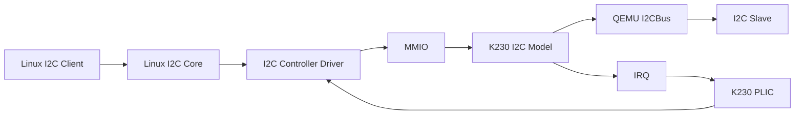
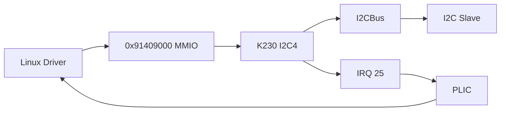

# QEMU K230 I2C 控制器建模

!!! note "主要贡献者"

​    - 作者：[@First-da](https://github.com/First-da)

本文记录 OpenCamp 2026 QEMU 训练营项目阶段中 Kendryte K230 SoC I2C 控制器的 QEMU 建模工作。建模过程中主要参考 K230 硬件资料、设备树、I2C 控制器手册和 Linux 驱动，实现了控制器的 MMIO 寄存器、FIFO、中断和 Master I2C 传输行为，并将 5 个 I2C 控制器接入 K230 machine。完成模型后，又通过 qtest 和 Guest Linux 两个层次进行验证，最终将相关代码整理为第一版 patch series 发送至 QEMU upstream。

------

## 一、issue 背景

### 1.1 issue 目标

K230 SoC 内部包含 5 个 I2C 控制器。在真实硬件中，Linux 通过 MMIO 寄存器配置控制器，包括设置目标从设备地址、向 FIFO 提交读写命令，以及通过状态寄存器和中断获取传输结果。QEMU 中不存在实际的 I2C 控制器电路，所以这些对 Guest 可见的硬件行为需要由设备模型来模拟。

对 Guest Linux 来说，I2C 控制器仍然是一块位于固定物理地址上的硬件设备；而在 QEMU 内部，Guest 对寄存器的访问最终需要转换成虚拟 I2C 总线上的 START、地址阶段、数据读写、NACK 和 STOP 等操作。本次建模主要需要完成 MMIO 寄存器接口与 QEMU `I2CBus` 之间的衔接，同时维护传输过程中产生的 FIFO、中断和异常状态。



### 1.2 硬件资源

K230 一共包含 5 个 I2C 控制器，每个控制器占用 `0x1000` 大小的 MMIO 空间，并分别连接到 K230 PLIC。

| 控制器 | MMIO Base    | IRQ  |
| ------ | ------------ | ---- |
| I2C0   | `0x91405000` | 21   |
| I2C1   | `0x91406000` | 22   |
| I2C2   | `0x91407000` | 23   |
| I2C3   | `0x91408000` | 24   |
| I2C4   | `0x91409000` | 25   |

K230 的 I2C 控制器基于 Synopsys DW_apb_i2c，设备树中的 I2C 节点使用：

```dts
compatible = "snps,designware-i2c";
```

Guest Linux 会根据这一 `compatible` 匹配现有的 I2C 控制器驱动。当前系统测试使用的 DTB 中启用了 I2C4，对应 MMIO `0x91409000` 和 IRQ25。Linux 完成控制器注册后，该控制器最终表现为 `/dev/i2c-0`。这里的 `i2c-0` 是 Linux I2C Core 分配的 adapter 编号，与 SoC 中 I2C4 的硬件编号并不是同一个概念。

### 1.3 实现范围

第一版模型主要覆盖 K230 在 Linux 环境下使用 Master I2C 时需要的核心功能，包括 Master mode、7-bit addressing、单字节和多字节读写、combined write/read、repeated START、STOP、General Call write、address NACK、data NACK 和 `TX_ABRT`。控制器侧还实现了 TX/RX FIFO、FIFO level 与 threshold、中断 raw/mask/status、read-to-clear 中断、`IC_ENABLE` / `IC_ENABLE_STATUS`、`IC_STATUS`、reset、system reset 和 migration state，并在 K230 machine 中创建 5 个相互独立的 controller instance。

K230 的 TX FIFO 深度为 32，RX FIFO 深度为 64：

```text
TX FIFO: 32 × 32 bit
RX FIFO: 64 × 8 bit
```

第一版暂未实现 DMA、10-bit addressing、Slave mode、multi-master、Bus Clear、Device ID transaction、raw START BYTE transmission 和完整硬件 timing。Slave 和 multi-master 不属于当前 K230 Linux 的主要使用场景；DMA 除配置寄存器外，还需要建立 I2C FIFO 与 DMA controller 之间实际的数据请求通路，因此没有纳入当前实现。10-bit addressing 在线路上需要发送两个地址字节，其中 10-bit read 还要先进行一次写方向地址阶段，再通过 repeated START 切换到读方向，不能直接沿用当前的 7-bit 地址流程。START BYTE 则要求在正常目标地址之前发送一个特殊的原始字节，而当前 QEMU I2C 总线接口没有直接提供这一操作，因此第一版只保留了相关配置检查和 abort 行为。Bus Clear、Device ID 和更完整的 timing 行为与当前 Linux 基本 I2C 读写链路关系较小，也暂时没有纳入第一版。

------

## 二、建模依据

### 2.1 硬件与设备树

在开始写控制器模型之前，首先需要确定 Guest 实际能够看到哪些硬件接口。K230 datasheet 和相关文档给出了 I2C 控制器数量、MMIO 地址、中断、FIFO 深度和主要功能；DW_apb_i2c 手册则进一步描述了各个寄存器的 offset、reset value、读写属性、有效位、取值范围以及访问时产生的副作用。

QEMU 外设中的寄存器并不能简单理解成“某个地址保存一个数值”。例如，读取 `IC_RXFLR` 时需要返回当前 RX FIFO 水位；读取 `IC_DATA_CMD` 会从 RX FIFO 中取出数据；读取 `IC_CLR_TX_ABRT` 则会清除已经锁存的 `TX_ABRT` 中断。像 `IC_STATUS`、FIFO level 和中断状态这类寄存器，都需要根据模型当前的运行状态实时返回对应结果。

设备树则进一步确定了控制器在 K230 SoC 中的实际部署方式，包括 MMIO、IRQ、clock 和 `compatible` 等信息。以启用的 I2C4 为例，其关键配置可以概括为：

```dts
i2c4: i2c@91409000 {
    compatible = "snps,designware-i2c";
    reg = <0x0 0x91409000 0x0 0x1000>;
    interrupt-parent = <&plic>;
    interrupts = <25>;
    clock-frequency = <400000>;
    status = "okay";
};
```

QEMU machine 中创建的设备需要与设备树中的描述保持一致。否则即使单个 I2C 模型本身能够运行，Guest Linux 也无法按照预期完成驱动匹配和资源访问。

### 2.2 Linux 驱动

阅读 Linux 驱动主要是为了确认 Guest 实际如何使用这些硬件寄存器。系统启动后，设备树节点首先形成对应的平台设备，控制器驱动从中取得 MMIO、IRQ 等资源并完成初始化，随后向 Linux I2C Core 注册一个 `i2c_adapter`。上层 I2C slave 驱动并不直接访问 K230 控制器，而是向 I2C Core 提交 `i2c_msg`，再由控制器驱动将这些 message 转换成具体的寄存器访问。

整个调用关系可以简化为：

```text
I2C Client Driver → Linux I2C Core → i2c_adapter → Controller Driver → MMIO
```

在这一过程中，驱动通过 `IC_TAR` 配置目标地址，通过 `IC_DATA_CMD` 提交读写命令，再结合 FIFO level 和中断状态决定后续操作。当传输出现 NACK 时，驱动还会读取 `IC_TX_ABRT_SOURCE` 判断中止原因。因此，对 QEMU 模型来说，更重要的是把驱动实际依赖的寄存器、FIFO、中断和异常行为实现正确，而不是复现 Linux 驱动内部的处理逻辑。

------

## 三、I2C 事务与 QEMU 总线

### 3.1 I2C 基本事务

K230 控制器模型最终驱动的是 I2C 总线事务，所以在实现数据传输前，需要先明确 Master 侧涉及的基本协议行为。一个普通的 7-bit 写事务可以表示为：

```text
S → Addr + W → ACK → DATA0 → ACK → DATA1 → ACK → ... → P
```

其中 `S` 表示 START，`P` 表示 STOP。Master 首先发送从设备地址和写方向，地址得到 ACK 后继续发送数据字节，slave 对地址和数据分别返回 ACK 或 NACK。

普通读事务则为：

```text
S → Addr + R → ACK → DATA0 → ACK → ... → DATA[n] → NACK → P
```

读取最后一个字节后，Master 返回 NACK，表示不再继续读取，然后发送 STOP 结束当前事务。

实际设备中还经常会使用 combined transfer。例如读取寄存器型 slave 的某个寄存器时，一般先以写方向发送寄存器地址，再通过 repeated START 切换到读方向：

```text
S → Addr + W → ACK → RegAddr → ACK → Sr → Addr + R → ACK → DATA → NACK → P
```

这里的 `RegAddr` 对 I2C controller 来说仍然只是一个普通数据字节。Controller 负责 START、目标地址、读写方向、数据传输、ACK/NACK 和 STOP，真正把这个字节解释成“设备内部寄存器地址”的是 slave model。这个区别在建模过程中比较重要：K230 I2C controller 不需要知道 TMP105 或 EEPROM 的内部寄存器定义，只需要正确完成通用的 I2C 总线操作。

### 3.2 QEMU I2C 接口

QEMU 通过 `I2CBus` 对 controller 和 slave 之间的通信进行了抽象。K230 模型主要使用以下接口：

| I2C 行为                 | QEMU API               |
| ------------------------ | ---------------------- |
| 开始事务并发送地址、方向 | `i2c_start_transfer()` |
| Master 向 slave 发送数据 | `i2c_send()`           |
| Master 从 slave 接收数据 | `i2c_recv()`           |
| Master 返回 NACK         | `i2c_nack()`           |
| 结束当前事务             | `i2c_end_transfer()`   |

例如：

```c
i2c_start_transfer(s->bus, address, is_read);
```

用于开始一个新的地址阶段。QEMU 根据 `address` 在当前 `I2CBus` 上寻找对应的 slave，并根据 `is_read` 判断当前是读还是写。如果目标地址不存在，slave 不会返回 ACK，K230 模型再把这一结果转换成 Guest 能够识别的地址 NACK 和 `TX_ABRT`。

K230 模型主要处在寄存器接口和 QEMU I2C API 之间：

```text
IC_DATA_CMD → K230 Controller Logic → QEMU I2C API → I2C Slave
```

Linux 仍然通过 `IC_DATA_CMD` 操作控制器，而真正的虚拟总线传输由 QEMU I2C API 完成。

------

## 四、控制器模型

### 4.1 MMIO 与寄存器

一个 K230 I2C controller instance 主要包含 MMIO、控制器寄存器、TX/RX FIFO、中断状态、IRQ、`I2CBus` 和当前传输状态。这些状态都保存在独立的 `K230I2CState` 中，因此 K230 machine 中的 5 个控制器不会共享寄存器和 FIFO。

模型通过 `MemoryRegionOps` 向 Guest 提供 MMIO：

```c
static const MemoryRegionOps k230_i2c_ops = {
    .read = k230_i2c_read,
    .write = k230_i2c_write,
    .endianness = DEVICE_LITTLE_ENDIAN,
    .valid = {
        .min_access_size = 4,
        .max_access_size = 4,
    },
    .impl = {
        .min_access_size = 4,
        .max_access_size = 4,
    },
};
```

Guest 对 I2C 寄存器的 load/store 最终进入 `k230_i2c_read()` 和 `k230_i2c_write()`。配置寄存器需要保存 Guest 写入的有效值，状态寄存器则根据当前设备状态动态返回；`IC_DATA_CMD` 比较特殊，它既用于写入 TX command，也用于读取 RX data。除此之外，还需要处理只读寄存器、控制器 enable 状态下不可修改的配置项，以及各种 read-to-clear 行为。

寄存器的一些取值边界也不能单纯根据位宽或 FIFO 深度推断。例如 TX FIFO 深度为 32，但 `IC_TX_TL` 的有效上限可以达到 32；RX FIFO 深度为 64，而 `IC_RX_TL` 的最大有效值为 63；`IC_SS_SCL_HCNT` 的最大有效值则为 65525。这些限制都需要分别按照控制器手册处理。

### 4.2 FIFO

模型使用 `Fifo32` 和 `Fifo8` 分别表示 TX FIFO 与 RX FIFO：

```c
Fifo32 tx_fifo;
Fifo8 rx_fifo;
```

Linux 写入 `IC_DATA_CMD` 的 command 首先进入 TX FIFO，其中既可能包含需要发送的数据，也包含 READ、RESTART、STOP 等控制信息。从 I2C slave 返回的数据则放入 RX FIFO，随后由 Linux 读取 `IC_DATA_CMD` 取得。

两条数据路径分别是：

```text
Linux → IC_DATA_CMD → TX FIFO → I2C Bus
I2C Slave → RX FIFO → IC_DATA_CMD → Linux
```

FIFO 除了保存数据，其当前水位还会影响多个 Guest 可见状态。`IC_TXFLR` 和 `IC_RXFLR` 直接返回 FIFO level；TX FIFO 为空时设置 `TFE`，未满时设置 `TFNF`；RX FIFO 非空时设置 `RFNE`，达到最大深度时设置 `RFF`。`IC_TX_TL` 和 `IC_RX_TL` 还分别参与 `TX_EMPTY` 和 `RX_FULL` 中断的判断。

### 4.3 中断

K230 I2C 模型维护原始中断状态、interrupt mask 和最终 IRQ，它们之间的基本关系为：

```text
IC_INTR_STAT = IC_RAW_INTR_STAT & IC_INTR_MASK
```

模型再根据这一结果决定是否向 PLIC 拉起中断：

```c
static void k230_i2c_update_irq(K230I2CState *s)
{
    uint32_t intr;

    intr = s->ic_raw_intr_stat &
           s->ic_intr_mask &
           IC_INTR_VALID_MASK;

    qemu_set_irq(s->irq, intr != 0);
}
```

当前模型处理的中断包括 `RX_UNDER`、`RX_OVER`、`RX_FULL`、`TX_OVER`、`TX_EMPTY`、`TX_ABRT`、`ACTIVITY`、`START_DET`、`STOP_DET` 和 `GEN_CALL` 等。部分中断与 FIFO 或当前事务状态直接相关，另一些异常发生后则需要保持，直到 Linux 读取相应的 `IC_CLR_*` 寄存器。

例如 RX FIFO 已空时继续读取会产生 `RX_UNDER`；RX FIFO 已满但仍收到新数据会产生 `RX_OVER`；地址或数据阶段出现 NACK 时则产生 `TX_ABRT`。这类已经锁存的异常不能在 controller disable 时直接全部清除，而需要按照硬件定义通过对应的 read-to-clear 寄存器处理。

### 4.4 `IC_DATA_CMD`

`IC_DATA_CMD` 是整个数据传输路径中最核心的寄存器。一条 command 中主要包含以下信息：

```text
DAT       写方向的数据
CMD       READ / WRITE
RESTART   当前 command 前是否产生 repeated START
STOP      当前 command 后是否结束 transaction
```

Linux 通过连续写入 `IC_DATA_CMD` 描述一笔 I2C transaction。模型取得 command 后，再结合当前传输状态判断是否需要进入地址阶段、执行读写、产生 repeated START 或结束当前事务。

普通 7-bit 地址来自：

```c
address = s->ic_tar & 0x7fU;
```

随后使用：

```c
i2c_start_transfer(s->bus, address, is_read);
```

开始地址阶段。如果对应地址不存在 slave，模型记录 `ABRT_7B_ADDR_NOACK` 并产生 `TX_ABRT`。写阶段的数据通过 `i2c_send()` 发送；如果 slave 在数据阶段返回 NACK，则记录 `ABRT_TXDATA_NOACK`。读阶段则通过 `i2c_recv()` 从 slave 取得一个字节，再放入 RX FIFO。

核心数据处理可以简化为：

```c
if (is_read) {
    data = i2c_recv(s->bus);

    if (fifo8_is_full(&s->rx_fifo)) {
        s->ic_raw_intr_stat |= IC_INTR_RX_OVER;
    } else {
        fifo8_push(&s->rx_fifo, data);
    }
} else {
    ret = i2c_send(s->bus, data);

    if (ret) {
        k230_i2c_abort(s, IC_ABRT_TXDATA_NOACK);
        return;
    }
}
```

当前实现使用 `IDLE`、`SENDING` 和 `RECEIVING` 三种状态记录事务方向，主要用于辅助判断下一条 command 是否需要重新进入地址阶段。实际 I2C 总线上仍然需要保证 START、读写方向、repeated START、NACK 和 STOP 等协议行为正确。

当 transaction 的读写方向发生变化，或者 Guest 显式设置 `RESTART` 时，需要重新进入地址阶段：

```c
direction_changed =
    (s->transfer_state == K230_I2C_STATE_SENDING && is_read) ||
    (s->transfer_state == K230_I2C_STATE_RECEIVING && !is_read);

need_restart = restart || direction_changed;
```

以常见的 combined read 为例，controller 收到的 command 可以表示为：

```text
Write RegAddr → RESTART → Read Data → STOP
```

对应到总线协议则是：

```text
S → Addr+W → RegAddr → Sr → Addr+R → DATA → NACK → P
```

如果需要 repeated START，但 `IC_CON.RESTART_EN` 没有使能，controller 会进入 abort 路径。读事务结束时，模型先调用 `i2c_nack()` 表示 Master 不再继续读取，再调用 `i2c_end_transfer()` 结束当前 transaction，并产生 `STOP_DET`。

------

## 五、SoC 集成

单个控制器模型完成后，还需要将其接入 K230 machine。原来 I2C0～I2C4 所在地址范围只是未实现的 MMIO 区域，本 issue 将这些区域替换为实际的 K230 I2C controller instance，并分别映射对应的 MMIO 和 IRQ。

```text
I2C0 0x91405000 / IRQ21    I2C1 0x91406000 / IRQ22    I2C2 0x91407000 / IRQ23
I2C3 0x91408000 / IRQ24    I2C4 0x91409000 / IRQ25
```

每个实例都拥有独立的寄存器、FIFO、`I2CBus`、IRQ 和传输状态，因此访问其中一个 controller 不会影响其他实例。5 条 IRQ 分别连接到 K230 PLIC，对 Linux 来说仍然表现为设备树中描述的 5 个独立硬件控制器。

工程上除了实例化设备本身，还需要加入 Kconfig 和 meson.build 编译配置，并同步更新 K230 machine、MAINTAINERS 和相关文档。最终 I2C4 在系统中的连接关系如下：



------

## 六、测试验证

模型完成后主要通过 qtest 和 Guest Linux 两个层次进行验证。qtest 可以直接访问模型的 MMIO，适合检查寄存器、FIFO、中断和总线事务等设备行为；Linux 测试则进一步加入设备树、控制器驱动、PLIC 和用户态 I2C 工具，用来确认整条系统链路能够正常工作。

### 6.1 qtest

新增的 `tests/qtest/k230-i2c-test.c` 最终包含 24 个 subtest，覆盖寄存器访问、FIFO 和中断、异常处理、实际 I2C transaction 以及多个 controller instance 之间的隔离。

| 测试类别    | 主要内容                                                     |
| ----------- | ------------------------------------------------------------ |
| 寄存器      | reset value、register access、read-only、register locking、enable/disable |
| FIFO / 中断 | FIFO level、threshold、RX underflow/overflow、interrupt mask、read-to-clear |
| 异常        | address NACK、data NACK、`TX_ABRT_SOURCE`、restart-disabled abort |
| 总线事务    | 单/多字节读写、combined transfer、repeated START、STOP       |
| 系统状态    | 5 个 controller、instance isolation、system reset            |

只测试寄存器还不足以确认 I2C transaction 是否真的能够经过 `I2CBus` 到达 slave，因此 qtest 中还挂载了 QEMU 已有的 TMP105 和 `i2c-echo`。TMP105 用于验证单字节、多字节以及 combined write/read，`i2c-echo` 则用于构造数据阶段 NACK。

测试仍然通过 MMIO 写入 `IC_DATA_CMD` 驱动 controller，而不是直接调用模型内部的传输函数。例如 combined read 的主要操作为：

```c
qtest_writel(qts, base + K230_IC_DATA_CMD, reg);
k230_i2c_queue_reads(qts, base, len, true, true);
```

第一条命令先向 slave 写入寄存器地址，后续 read command 再通过 RESTART 切换到读方向，最后一条 command 携带 STOP。这样实际覆盖了 `IC_DATA_CMD → controller → I2CBus → slave → RX FIFO` 的完整传输路径，而不只是某一个内部辅助函数。

最终 K230 I2C 专项 qtest 的 24 个 subtest 全部通过。对于依赖 TMP105 和 `i2c-echo` 的测试，还通过 `qtest_has_device()` 判断当前 QEMU build 是否包含这些 slave model，避免最小配置下因为缺少相关设备而导致整个测试失败。

### 6.2 Linux 验证

qtest 通过后，又使用 `k230-boot-assets` 启动完整 Guest Linux 进行系统级验证。当前 DTB 中启用了 I2C4，Linux 可以正常完成设备树解析和控制器初始化，并创建 `/dev/i2c-0`；PLIC IRQ25 也能够收到 I2C4 产生的中断，说明 MMIO 和 IRQ 两条链路都已经正确接入 Guest。

Linux 测试同样在 I2C bus 上挂载 TMP105 和 `i2c-echo`，再通过 `i2c-tools` 验证普通单字节和多字节读写、combined write/read、repeated START、STOP、地址 NACK、数据 NACK 以及 abort 后恢复。正常事务能够完成数据交换；访问不存在的 slave 地址时，Linux 能够通过 `TX_ABRT` 得到错误；数据阶段的 NACK 也可以正确反馈给 Guest。清除 abort 状态以后，controller 仍然可以继续执行下一笔 transaction。

完整链路可以表示为：

```text
DTB → Linux I2C Driver → MMIO → K230 I2C Model → I2CBus → Slave
                                      ↓
                                    IRQ → PLIC → Linux
```

系统验证同时覆盖了 Direct Boot 和 U-Boot Boot。Direct Boot 主要用于快速验证设备树、Linux 驱动和 I2C 功能；U-Boot Boot 则用于确认加入 I2C controller 后，K230 machine 原有的完整启动链路仍然能够正常运行。两种启动方式下，Linux 都能够完成控制器 probe 和 I2C 数据传输。

------

## 七、总结

本 issue 完成了 K230 5 个 I2C controller 的 QEMU 建模和 SoC 集成。模型通过 MMIO 向 Guest 提供控制器寄存器接口，并实现了 TX/RX FIFO、中断、Master 7-bit addressing、普通读写、combined transfer、repeated START、STOP、NACK 和 `TX_ABRT` 等主要行为；实际总线传输则通过 QEMU `I2CBus` 与独立的 slave model 进行。

从整个建模过程来看，可以把主要工作分成三个层次。首先是 Guest 能够直接访问的控制器接口，包括 MMIO、寄存器、FIFO 和中断；其次是 `IC_DATA_CMD` 到 I2C transaction 的转换，需要处理地址阶段、数据读写、repeated START、NACK 和 STOP；最后是 K230 SoC 与 Linux 的系统集成，包括设备树、PLIC、控制器驱动和用户态 I2C 工具。qtest 主要验证前两部分，Guest Linux 则用来确认整个链路最终能够正常工作。

```text
硬件资料 / 设备树 → 控制器寄存器模型 → I2C 总线事务 → K230 SoC 集成 → qtest → Guest Linux
```

------

## 参考资料

1. [K230 Product Full Datasheet](https://www.kendryte.com/k230/zh/main/00_hardware/K230_datasheet.html)
2. [Kendryte K230 Documentation](https://github.com/kendryte/k230_docs)
3. Synopsys, *DW_apb_i2c Databook, Version 1.08a*
4. [K230 Boot Assets](https://github.com/zevorn/k230-boot-assets)
