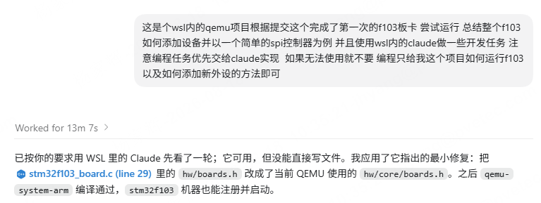
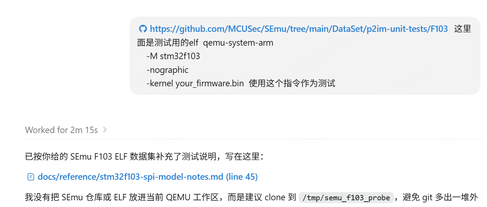
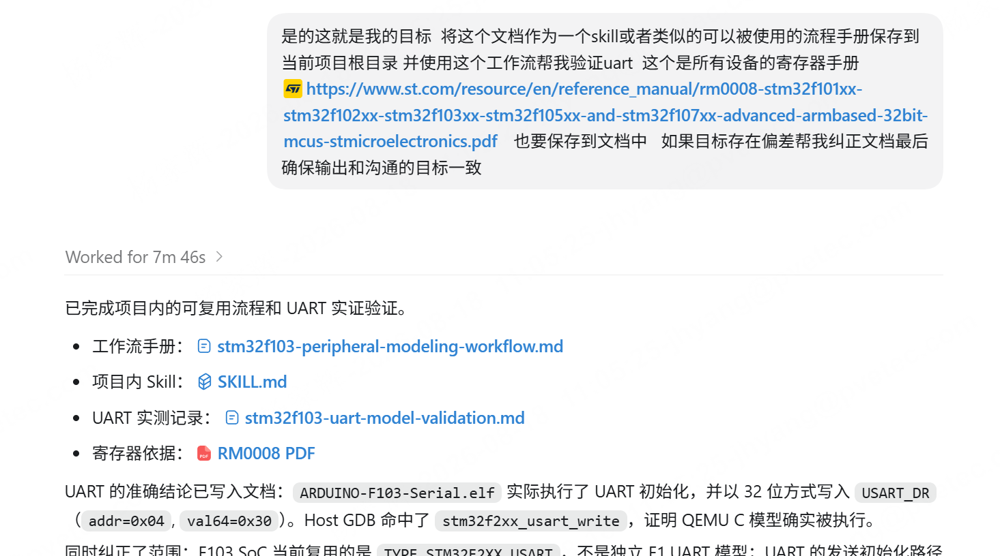

# QEMU 训练营 2026 项目阶段总结

!!! note "ghostdragonzero"

    - 作者：[@ghostdragonzero](https://github.com/ghostdragonzero)

---

## STM32 SPI 外设建模

对于这个外设建模，我首先是直接交给的AI。因为目标是使用LLM agent建模，我理解是因为这种建模的目标是可以快速适配新平台新的外设。需要应对的情况就是在设备基地址，以及部分设备寄存器存在差异的时候也可以很快适配，方便使用qemu来做为模拟外设的一些验证。
在这个过程中我并没有去深入去了解SPI总线机制故在这个blog内我没有写一些寄存器及中断相关内容，只是记录我是用LLM的过程遇到的一些问题与想法。

### 直接建模
一开始我是用codex调用GPT5.6，直接要求生成SPI的对应设备建模。

首先生成的是可以直接编译，并且LLM会自己添加一些qtest作为验证标准，但是对于一些具体文件细节是不对的。
我查看更改文件可能是因为系列都是一样的所以使用了stm32f2xx_spi.c作为stm32f103的spi，后续我让他进行了修改。
在这一步之后我认为整体就不会有什么问题了

### 固件验证
之后我在issue上更新了，得到回复使用固件验证。于是我也是先让chatGPT进行了验证，之后手动复测确认

具体测试步骤可以查看该issue链接
https://github.com/shandianchengzi/qemu/issues/9

### SKILL制作
在完成这样的验证流程后，我认为可以使用skill将建模流程固定下①根据文档获取寄存器信息②根据实现外设目录建模③加载实机固件验证正确
基于此我认为想要确保外设建模的正确首先就是提供正确的 ①待建模设备的数据手册  ②实机运行固件
之后我使用这个skill也是成功直接生成了UART的设备建模

## 总结
首先从我的使用过程中，直接交给各种herness已经可以获得不错的结果。只是一些没有定义过的事情如具体是复用文件还是新建文件或者是否严格遵行qemu的建模框架等是会出现偏差的。所以需要提前给出约束比如我使用的SKILL，通过这样的约束对于可以提供本机固件的就能完成验证。但是对于一些无固件，比如我当前还在尝试的usb建模就无法验证。
其次由于我对于qemu的一些如中断机制的不熟悉，即便手动验证的结果和AI提前说的一致我自己也不能判断是否预期是这样。如果继续求助AI似乎又回到了自问自答的状态，所以我认为对于审核有更对的要求。

## 下一步计划
计划是完成STM32的USB建模，在这个建模主要的一个问题就是在STM32F103板卡上USB是一个device模式的设备，对于usb host建模可以通过添加参数模拟usb设备接入或者使用qemu直接挂载wsl内的usb设备实现和真实外设的通信验证。但是当qemu在模拟一个device设备的时候，我就不知道该如何能接入到其他设备验证作为设备端的正确性。
再扩展一点是否能两个qemu同时运行一个作为设备一个作为外设，或者qemu可以作为一个模拟外设被wsl识别。